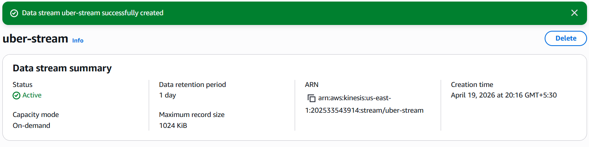
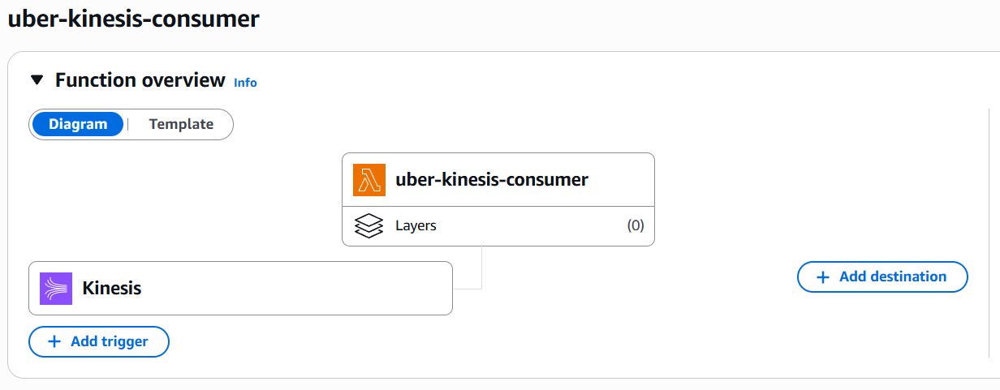
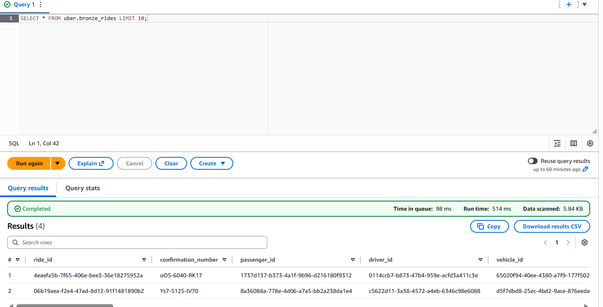
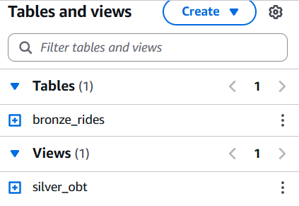
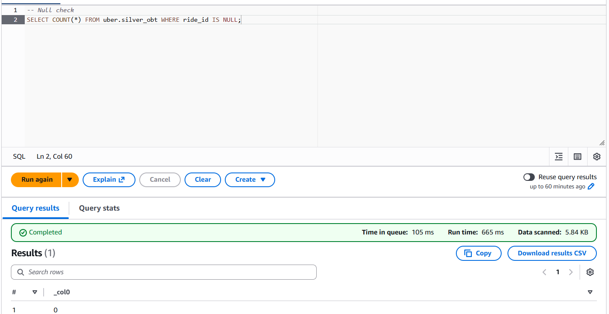
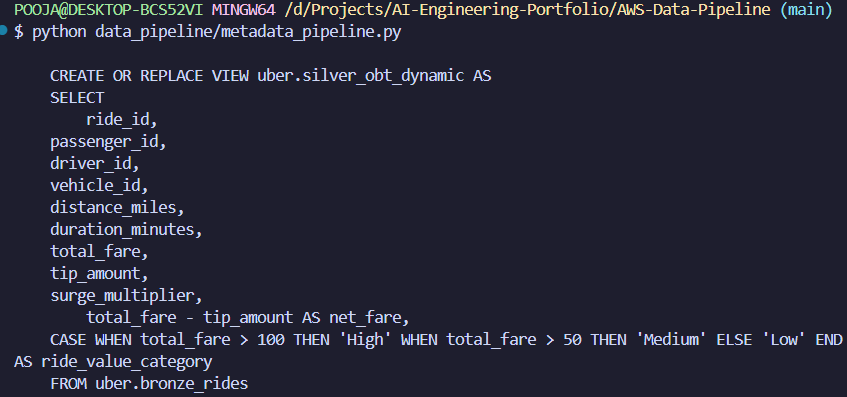
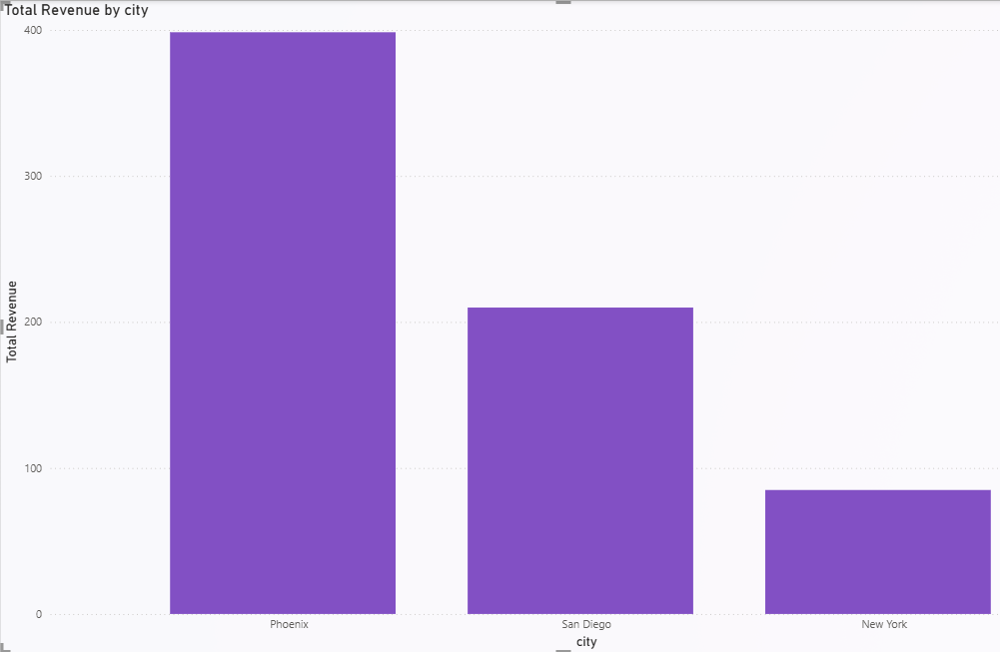

# 🚖 Uber Real-Time Data Engineering Pipeline (AWS)

## 📌 Overview

This project demonstrates an **end-to-end real-time data engineering pipeline** inspired by Uber-like ride booking systems. It simulates real-time ride events, processes them using AWS services, and transforms them into analytical datasets for business intelligence.

---

## ⚙️ Tech Stack

| Layer          | Tools                 |
| -------------- | --------------------- |
| Ingestion      | FastAPI               |
| Streaming      | Amazon Kinesis        |
| Processing     | AWS Lambda            |
| Storage        | Amazon S3             |
| Query Engine   | Amazon Athena         |
| Transformation | SQL                   |
| Visualization  | Power BI              |
| Orchestration  | EventBridge Scheduler |

---

## 🔄 Data Pipeline Flow

### 1. Data Generation (Web App)

* Built using FastAPI
* Simulates ride booking events
* Generates realistic ride data:

  * Passenger
  * Driver
  * Location
  * Fare
  * Timestamps

---

### 2. Real-Time Streaming (Kinesis)

* Events sent to Kinesis stream
* Acts as **buffer between producer & consumer**
* Enables scalable real-time ingestion

---

### 3. Processing (Lambda)

* Triggered by Kinesis
* Converts records into JSON format
* Writes data to S3 (Bronze layer)

---

### 4. Data Lake (S3)

#### Bronze Layer:

* Raw JSON data
* Immutable
* Partitioned by timestamp

---

### 5. Transformation (Athena)

#### Silver Layer (OBT - One Big Table):

* Cleaned data
* Type casting (timestamps fixed)
* Derived columns:

  * ride_value_category
  * trip_duration_category
  * surge_category

#### Gold Layer (Star Schema):

* Fact Table: `fact_rides`
* Dimension Tables:

  * dim_passenger
  * dim_driver
  * dim_vehicle
  * dim_location (SCD Type 2)
  * dim_payment
  * dim_booking

---

### 6. Slowly Changing Dimensions (SCD Type 2)

* Implemented using Athena CTAS
* Tracks historical changes
* Columns:

  * effective_date
  * end_date
  * is_current

---

### 7. Visualization (Power BI)

* Connected to Athena
* Created dashboards:

  * Revenue trends
  * Ride distribution
  * City-wise performance
  * Surge analysis

---

### 8. Orchestration (EventBridge + Lambda)

* Scheduled pipeline execution
* Runs every minute (configurable)
* Automates transformation pipeline

---

## 📊 Key Features

✔ Real-time streaming pipeline  
✔ End-to-end AWS architecture  
✔ Bronze → Silver → Gold layering  
✔ Star schema modeling  
✔ SCD Type 2 implementation  
✔ Metadata-driven transformations (config-based logic)  
✔ Automated orchestration  
✔ Production-style design

---

## ▶️ Run The App (LOCAL TEST)

Open terminal:

```bash
cd uber-data-pipeline-aws
pip install -r requirements.txt
uvicorn app.api:app --reload
```

---

## 🌐 Open in browser:

```
http://127.0.0.1:8000/
```

Click:  
👉 **Book Ride**

---

## ✅ Expected Output

* Page loads ✅
* Click button ✅
* Ride generated ✅
* Printed in terminal ✅

---

## Power BI

Open **Power BI Desktop**

### Steps:

1. Click **Get Data**
2. Select **Text/CSV**
3. Choose your file

👉 Click:

```text
Load
```

---

## 🚀 STEP 3 — Data Modeling (IMPORTANT)

**Modeling → New Measure**

### 1️⃣ Total Revenue

```DAX
Total Revenue = SUM('table'[total_fare])
```

### 2️⃣ Total Rides

```DAX
Total Rides = COUNT('table'[ride_id])
```

### 3️⃣ Average Fare

```DAX
Avg Fare = AVERAGE('table'[total_fare])
```

### 4️⃣ Revenue per Mile

```DAX
Fare per Mile = DIVIDE(SUM('table'[total_fare]), SUM('table'[distance_miles]))
```

---

## 🧠 Full Pipeline 

```text
User
  ↓
FastAPI (Data Generator)
  ↓
Amazon Kinesis (Streaming Layer)
  ↓
AWS Lambda (Ingestion / Consumer)
  ↓
Amazon S3 (Bronze Layer - Raw Data)
  ↓
AWS Glue Data Catalog (Schema Management)
  ↓
Amazon Athena (SQL Engine)
      ↓
   Silver Layer (Cleaned OBT)
      ↓
   Gold Layer (Star Schema + SCD Type 2)
  ↓
Power BI Dashboard (Analytics Layer)

-----------------------------------------

Automation Layer:
EventBridge Scheduler
      ↓
Lambda (Orchestrator)
      ↓
Athena Queries (Refresh Silver + Gold)

-----------------------------------------

Monitoring Layer:
CloudWatch Logs + Metrics
```

---

# 🏆 What is Achieved 

✅ Streaming ingestion (Kinesis)  
✅ Serverless processing (Lambda)  
✅ Data lake (S3)  
✅ Transformations (Athena)  
✅ Star schema (Gold)  
✅ SCD Type 2  
✅ Metadata-driven pipeline  
✅ Dashboard (Power BI)  
✅ Orchestration (EventBridge)

---
















---