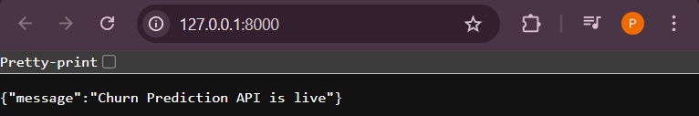
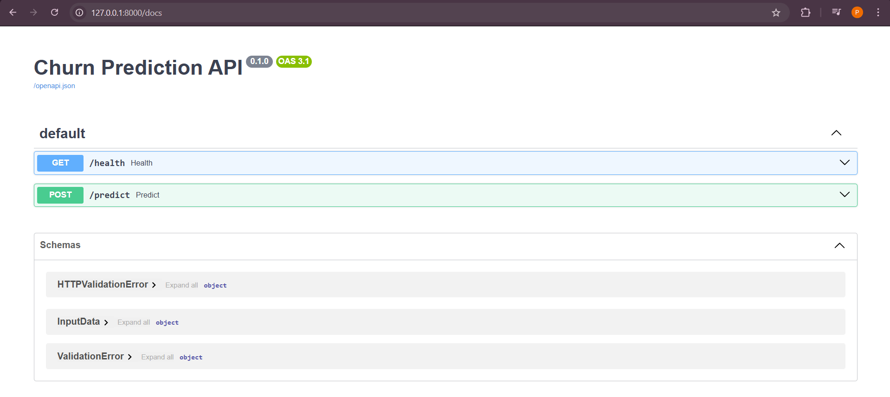
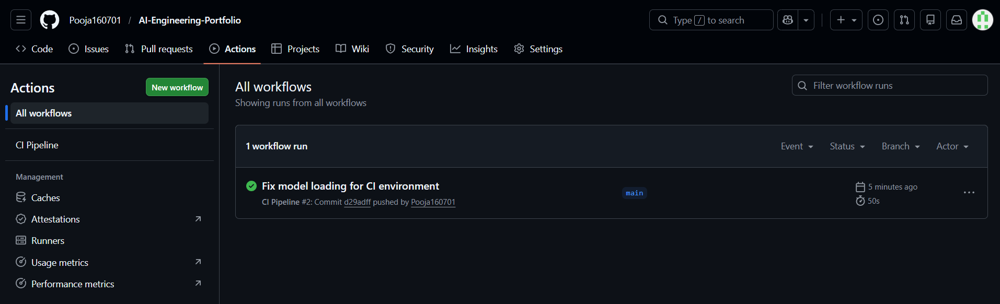
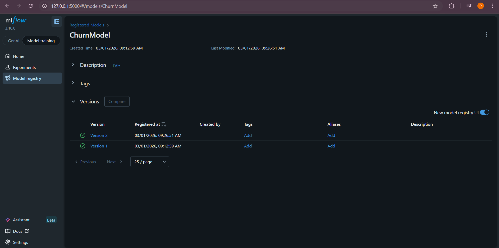
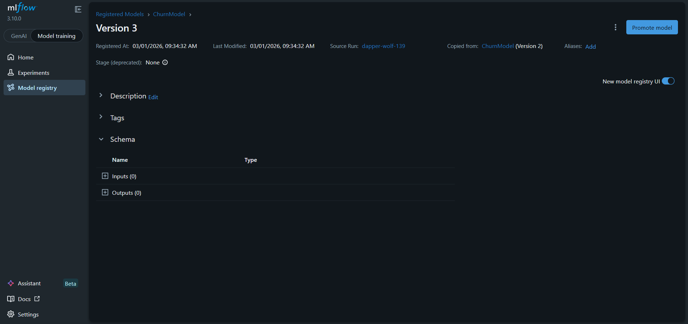
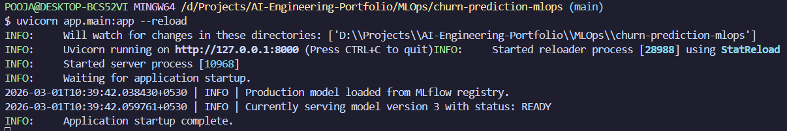
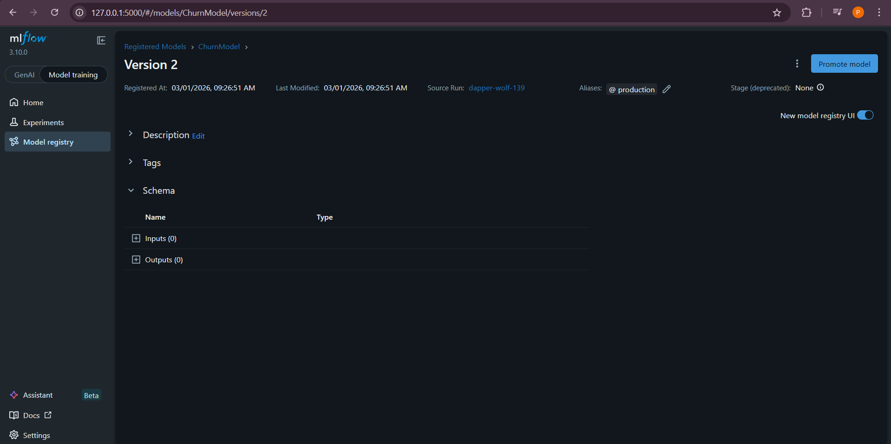
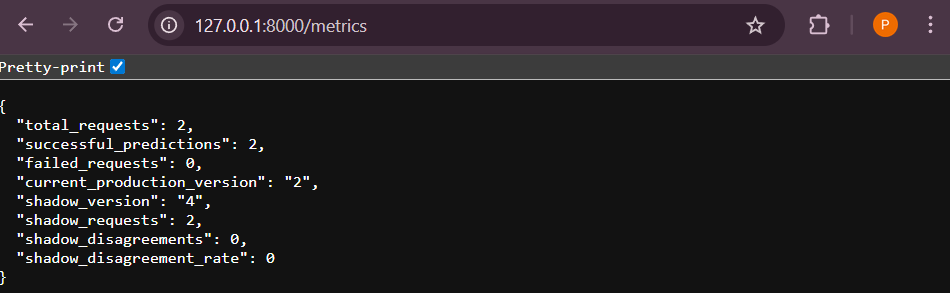

# 🚀 Production-Level MLOps with Shadow Deployment

# 📊 High-Level Architecture Diagram

```
                        ┌─────────────────────────┐
                        │        Client           │
                        │  (Postman / Frontend)   │
                        └────────────┬────────────┘
                                     │
                                     ▼
                        ┌─────────────────────────┐
                        │      FastAPI Service    │
                        │  (app/main.py)          │
                        └────────────┬────────────┘
                                     │
          ┌──────────────────────────┼──────────────────────────┐
          ▼                          ▼                          ▼
┌────────────────┐        ┌────────────────┐        ┌────────────────────┐
│ Production     │        │ Shadow Model   │        │ Metrics Tracker     │
│ Model (Alias)  │        │ Latest Version │        │ Counter + Logging   │
│ ChurnModel@prod│        │ ChurnModel/vN  │        │ Disagreements       │
└────────────────┘        └────────────────┘        └────────────────────┘
          │                          │                          │
          └──────────────┬───────────┘                          │
                         ▼                                      ▼
                  ┌──────────────────┐                  ┌──────────────────┐
                  │ MLflow Registry  │                  │ /metrics Endpoint│
                  │ Versioned Models │                  │ Live Monitoring  │
                  └──────────────────┘                  └──────────────────┘
                         ▲
                         │
                ┌──────────────────┐
                │ Training Pipeline│
                │ train.py         │
                │ RandomForest     │
                │ Auto-Register    │
                │ Auto-Compare     │
                └──────────────────┘
                         ▲
                         │
                ┌──────────────────┐
                │ Raw Dataset      │
                │ data/raw.csv     │
                └──────────────────┘
```

- Built a production-grade MLOps system using MLflow Model Registry for version control.

- The API loads the Production model via alias and routes all traffic to it.

- Simultaneously, a Shadow model (latest version) runs in parallel without affecting users.

- Compare the predictions live and track disagreement metrics.

- This enables safe validation before promoting a new model.

- The training pipeline automatically registers models and compares performance before alias updates.

---

# 🔄 End-to-End Flow

# 1️⃣ Training Flow

```
raw.csv
   ↓
Training Pipeline
   ↓
MLflow Experiment Tracking
   ↓
Model Registered in MLflow
   ↓
Accuracy Compared with Production
   ↓
If Better → Alias Updated
```

---

# 2️⃣ Inference Flow (Shadow Deployment)

```
Client Request
     ↓
FastAPI /predict
     ↓
Production Model (serves response)
     ↓
Shadow Model (runs silently)
     ↓
Compare Predictions
     ↓
Update Metrics
     ↓
Return Production Result
```

---

# 📈 Monitoring Layer

Your `/metrics` endpoint tracks:

* total_requests
* successful_predictions
* failed_requests
* production_version
* shadow_version
* shadow_requests
* shadow_disagreements
* shadow_disagreement_rate

This enables:

* Live monitoring
* Model quality comparison
* Safe rollout validation
* Rollback confidence

---

# 🧱 Create Virtual Environment

Run:

```bash
python -m venv venv
```

Activate:

```bash
source venv/Scripts/activate
```

You should see `(venv)` in terminal.

---

# 🧠 Why These Packages?

| Package       | Why                    |
| ------------- | ---------------------- |
| pandas, numpy | Data handling          |
| scikit-learn  | ML model               |
| mlflow        | Experiment tracking    |
| fastapi       | Production API         |
| uvicorn       | ASGI server            |
| pydantic      | Request validation     |
| pytest        | Testing                |
| loguru        | Professional logging   |
| python-dotenv | Environment management |
| pyyaml        | Config driven setup    |

---

# 🧪 Test It

Now run:

```bash
python train.py
```

Then:

```bash
mlflow ui
```

Open:

```
http://127.0.0.1:5000
```

You’ll see tracked experiment.


---

# ▶️ Run API Locally

Run:

```bash
uvicorn app.main:app --reload
```

Open:

```
http://127.0.0.1:8000/docs
```





You’ll see Swagger UI.

Test:

```json
{
  "feature1": 2,
  "feature2": 1
}
```

> Developed and deployed a container-ready FastAPI service serving a trained ML model with experiment tracking using MLflow.

---

# 🧹 Add .dockerignore

This prevents Docker from copying:

❌ Your virtual environment  
❌ MLflow artifacts  
❌ Git history  
❌ Cache

---

# CI/CD

1. Push to GitHub
2. Add GitHub Actions CI
3. Auto test on push



---

Now MLflow will:

* Create registered model
* Assign version number
* Store metadata

---

# 🎯 Promote Model to Production

After first run:

Go to MLflow UI → Models tab
You’ll see:

```
ChurnModel
Version 1
```

Promote to:

Production stage.

This simulates real model lifecycle.



---

# ✅ Modern Way Using Aliases

Click:

👉 **Add** under "Aliases"

Add alias name:

```id="x9p6mf"
Production
```

Click Save.

Now:

Version 2 → Alias: Production

This is the new MLflow approach.



---

# 🔁 Rollback

1. Go to MLflow → ChurnModel → Version 3
   Remove alias `production`

2. Go to Version 2
   Add alias `production`

Restart API.

> We use MLflow Model Registry with alias-based stage promotion.
> If a model fails, we reassign the Production alias to a previous stable version.
> No redeployment required.

This proves your service knows what it’s serving.



---

# 🚀 LIVE ROLLBACK SIMULATION 

Right now:

```
ChurnModel
Version 3 → alias: production
Version 2 → no alias
```

Your API serves:

```
Version 3
```

## 🔁 STEP 1 — Remove Alias From Version 3

Go to:

MLflow → ChurnModel → Version 3

Click pencil icon next to alias `production`

Remove it.

Save.

Now Version 3 has:

```
Aliases: —
```

---

## 🔁 STEP 2 — Assign Alias To Version 2

Go to:

Version 2 → Add alias

Add:

```
production
```

Save.

Now:

```
Version 2 → alias: production
```



---

## 🔄 STEP 3 — Restart API

```bash
uvicorn app.main:app --reload
```

Look at logs.

You should now see:

```
Currently serving model version 2
```


> Use MLflow Model Registry with alias-based routing.

> Production traffic is mapped to a model alias.

> If a model underperforms, we reassign the alias to a previous stable version.

> No redeployment required.

---

# Live counters


## 🧠 Why This Matters

In real production:

After deployment, teams monitor:

* Total traffic
* Success rate
* Error rate
* Model version in use

You now simulate this.

---

# 🧠 Automated Promotion Gate (Quality Check Before Production)

New model trained → Version 4

We automatically check:

* Accuracy must be ≥ 0.80
* If not → DO NOT promote

That is production governance.

> I implemented automated model governance using MLflow Model Registry where new model versions are evaluated against current production accuracy before alias-based promotion. This prevents accidental performance regressions in live environments.

---

# 🧠 Shadow Deployment

## 🎯 What Is Shadow Mode?

Production model handles traffic.

New model:

* Receives same input
* Makes prediction
* Does NOT return result to user
* Logs comparison internally

This prevents risky deployments.

---

## 🎯 What This Does

Now every request:

* Uses production
* Also tests shadow
* Logs differences

Example log:

```
Prod v2: 1 | Shadow v4: 0
```

---

## 🔥 Let’s Actually Trigger Shadow Logic

Shadow comparison only runs when `/predict` is called.

### Step 1 — Go to:

```
http://127.0.0.1:8000/docs
```

### Step 2 — Call `/predict` a few times with:

```json
{
  "feature1": 5,
  "feature2": 1
}
```

and

```json
{
  "feature1": 3,
  "feature2": 0
}
```

---

### 🧠 What Should Happen

In terminal logs you should now see:

```
Prod v2 prediction: X
Shadow v4 prediction: X
```

If both models behave the same (likely, since your dataset is deterministic), there will be no disagreements.

---

### Step 3 — Check `/metrics` Again



That proves:

✔ Shadow model received traffic  
✔ Production still serving  
✔ Disagreement tracking works

---

# ✅ Implemented:

✔ MLflow experiment tracking  
✔ Model registry  
✔ Versioning  
✔ Alias-based production routing  
✔ Automated training + registration  
✔ Accuracy comparison before promotion  
✔ Manual rollback  
✔ Shadow deployment  
✔ Live disagreement tracking  
✔ Metrics endpoint  
✔ Clean inference pipeline  
✔ Structured logging

---