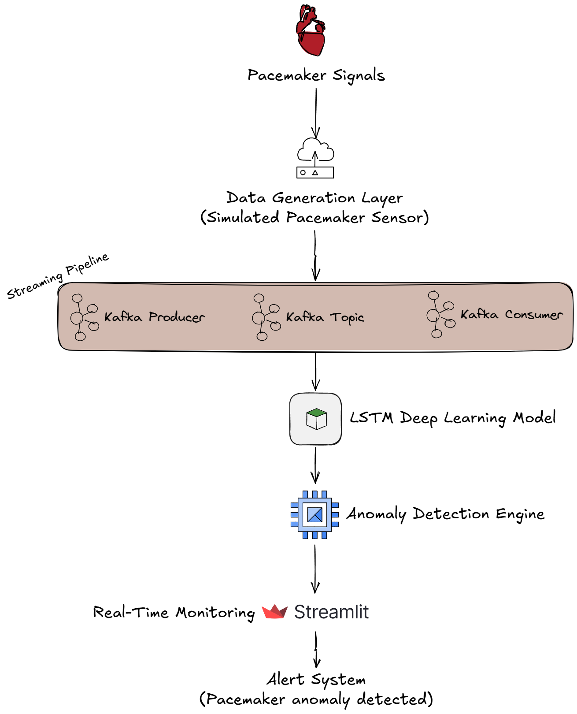
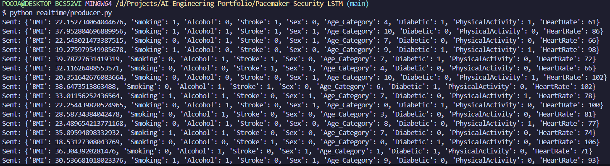
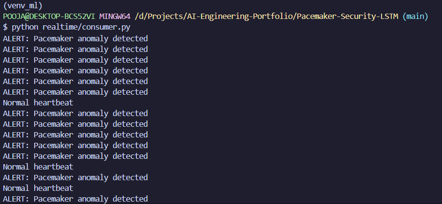
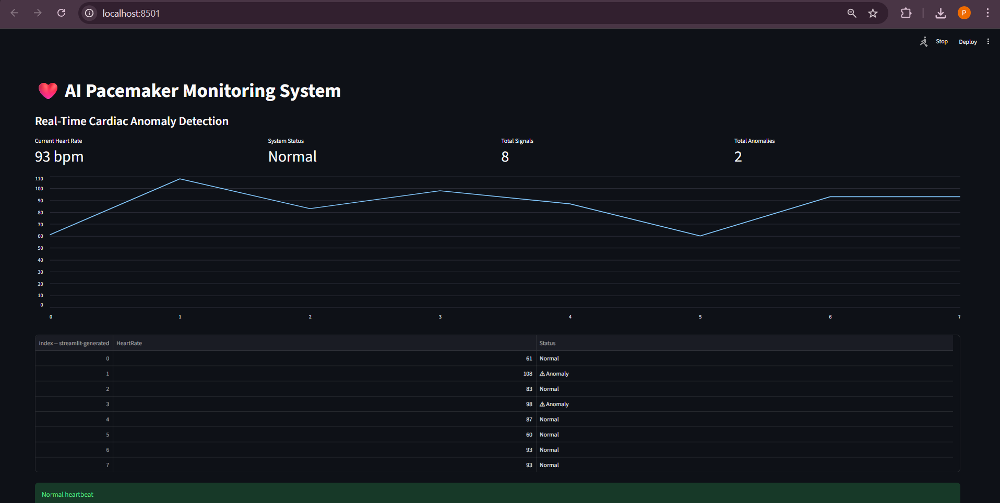
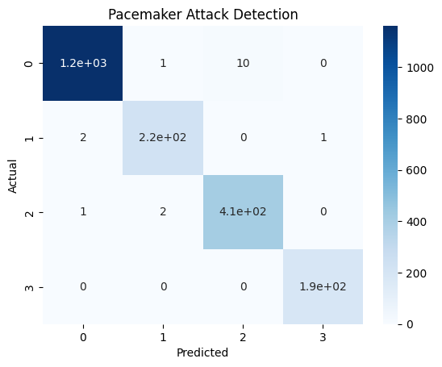

# ❤️ Real-Time Cardiac Anomaly Detection using LSTM & Streaming Data

A production-style **AI healthcare monitoring system** that detects abnormal pacemaker signals in real time using **Deep Learning (LSTM)** and **streaming architecture**.

The system analyzes patient heart signals and automatically flags **potential cardiac anomalies**, enabling early medical intervention.

---

# 🧠 Project Overview

Pacemakers are life-saving medical devices that regulate heart rhythms. However, abnormal signals or cyber-attacks on pacemakers can lead to serious health risks.

This project implements an **AI-powered monitoring system** capable of:

* Detecting abnormal cardiac rhythms
* Monitoring heart signals in real time
* Generating anomaly alerts
* Visualizing heart activity through a live dashboard

The system combines **deep learning, data streaming, and real-time visualization** to simulate a modern **AI healthcare monitoring platform**.

---

# 🚀 Key Features

✅ **LSTM Deep Learning Model** for anomaly detection  
✅ **Real-Time Pacemaker Signal Monitoring**  
✅ **Interactive Dashboard (Streamlit)**  
✅ **Live Heart Rate Visualization**  
✅ **Automatic Anomaly Alerts**  
✅ **Confusion Matrix & Model Evaluation**  
✅ **Scalable Real-Time Architecture**

---

# 🏗️ Architecture Diagram

## System Architecture



---

# System Workflow

The system processes pacemaker signals through the following pipeline:

1️⃣ Pacemaker device generates heart signals  
2️⃣ Signals are streamed through a data pipeline  
3️⃣ LSTM model analyzes the signal patterns  
4️⃣ Abnormal heart rhythms are detected  
5️⃣ Alerts are generated for anomalies  
6️⃣ Results are displayed in the real-time monitoring dashboard

---





---

# 📊 Dashboard Preview

The monitoring dashboard provides:

* Real-time heart rate monitoring
* Anomaly alerts
* Live heart signal chart
* System metrics

### Dashboard Example



---

# 🧠 Machine Learning Model

The anomaly detection model uses **Long Short-Term Memory (LSTM)** networks to capture temporal dependencies in heart signals.

### Model Architecture

```
Input Layer
    ↓
LSTM Layer (128 units)
    ↓
Dropout Layer
    ↓
LSTM Layer (64 units)
    ↓
Dense Layer
    ↓
Softmax Output
```

---

# 📈 Model Performance

| Metric    | Score   |
| --------- | ------- |
| Accuracy  | **98%** |
| Precision | **99%** |
| Recall    | **99%** |
| F1 Score  | **99%** |

### Confusion Matrix

Model performance demonstrates strong ability to classify:

* Normal Heartbeat
* Ventricular Fibrillation
* Atrial Fibrillation
* AV Block



---

# 📂 Project Structure

```
Pacemaker-Security-LSTM
│
├── data
│   └── pacemaker_dataset.csv
│
├── models
│   └── pacemaker_lstm_model.h5
│
├── notebooks
│   └── pacemaker_training.ipynb
│
├── realtime
│   ├── producer.py
│   ├── consumer.py
│   ├── inference.py
│   └── dashboard.py
│
├── results
│   ├── confusion_matrix.png
│   └── training_plot.png
│
└── README.md
```

---

# ⚙️ Installation

### Clone the Repository

```
git clone https://github.com/YOUR_USERNAME/Pacemaker-Security-LSTM.git
cd Pacemaker-Security-LSTM
```

---

### Create Virtual Environment

```
python -m venv venv
source venv/bin/activate
```

Windows

```
venv\Scripts\activate
```

---

### Install Dependencies

```
pip install -r requirements.txt
```

---

# ▶ Running the Project

### Train the Model

```
python src/train_model.py
```

---

### Run Real-Time Dashboard

```
streamlit run realtime/dashboard.py
```

Open in browser:

```
http://localhost:8501
```

---

# 📊 Example Output

| HeartRate | Status    |
| --------- | --------- |
| 78        | Normal    |
| 92        | Normal    |
| 105       | ⚠ Anomaly |
| 88        | Normal    |

---

# 🔬 Technologies Used

### Machine Learning

* TensorFlow
* Keras
* LSTM Networks

### Data Processing

* Pandas
* NumPy
* Scikit-learn

### Visualization

* Streamlit
* Matplotlib
* Seaborn

### Real-Time Simulation

* Kafka-style streaming
* Python event pipelines

---

# 🏥 Real-World Applications

This system can be used in:

* Smart healthcare monitoring
* Pacemaker security systems
* Remote patient monitoring
* Hospital ICU monitoring systems
* IoT healthcare devices

---

# 📚 Dataset

The dataset includes:

* BMI
* Smoking
* Alcohol consumption
* Stroke history
* Age category
* Diabetes status
* Physical activity
* Heart rate

Cardiac conditions include:

1. Normal heartbeat
2. Ventricular fibrillation
3. Atrial fibrillation
4. AV block

---