# 🚀 Enterprise-Grade Test Automation Framework for E-Commerce Platform

## Scalable UI, API & Performance Testing with CI/CD Integration

[](https://github.com/Pooja160701/AI-Engineering-Portfolio/actions/workflows/qa-ci.yml)

---

## 🎯 Project Overview

A production-ready QA Automation Framework designed to validate functional, API, and performance aspects of an e-commerce system.

The framework follows a layered, scalable architecture integrating:

- UI Automation (Playwright + POM)
- API Automation (Requests + Client Abstraction)
- Performance Testing (Locust)
- CI/CD (GitHub Actions)
- Containerized Execution (Docker)
- Allure Reporting & Artifact Storage

## 🧠 Tech Stack

### 🧪 UI Automation

- Playwright (Python)
- Pytest
- Page Object Model (POM)
- Screenshot Capture on Failure
- Parallel Execution (pytest-xdist)

### 🔌 API Testing

- Requests
- JSON Schema Validation
- Response Time Assertions
- Negative Case Validation
- API Client Abstraction Layer

### ⚡ Performance Testing

- Locust Load Simulation
- Concurrent User Testing
- Percentile-Based Latency Analysis

### ⚙ DevOps & Infrastructure

- GitHub Actions (Path-based monorepo CI)
- Dockerized Execution
- Allure Report Artifacts
- Environment Configuration via .env

---

# 🏗 Architecture

## 🔹 High-Level Flow

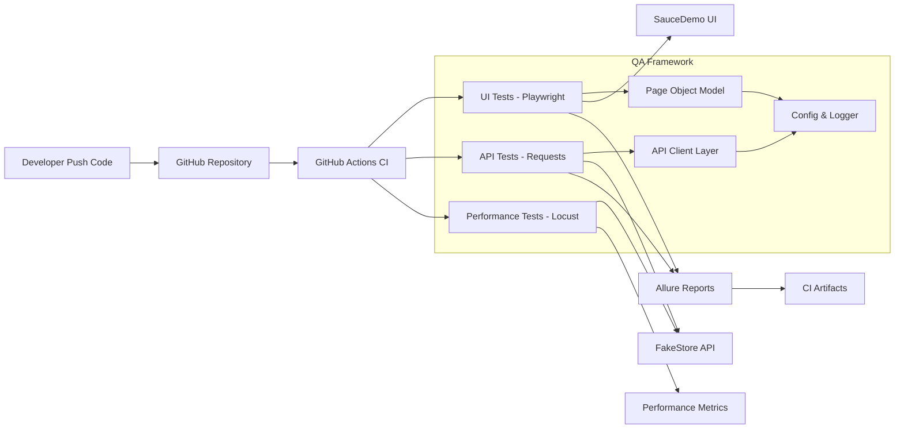

GitHub automatically renders this in README.

---

# 🧱 Layered Architecture

## 1️⃣ Presentation Layer

* UI automation (Playwright)
* Performance simulation (Locust)

## 2️⃣ Test Layer

* Pytest test cases
* Smoke / Regression tagging
* Parallel execution (xdist)

## 3️⃣ Abstraction Layer

* Page Object Model (UI)
* API Client abstraction (API)
* Config management
* Logger system

## 4️⃣ Infrastructure Layer

* GitHub Actions CI
* Docker container execution
* Artifact storage
* Environment configuration (.env)

---

# 📦 Folder-Level Architecture

Add this diagram too (simpler view):

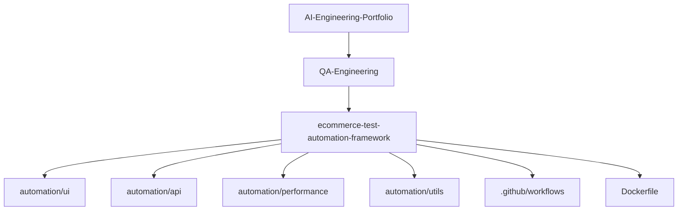

---

# 🎯 Setup Python Environment

Run:

```bash
python -m venv venv
```

Activate:

```bash
venv\Scripts\activate
```

---

# 🎯 Install Core Dependencies

Run:

```bash
pip install pytest playwright pytest-playwright requests allure-pytest locust python-dotenv
```

Now install browser drivers:

```bash
playwright install
```

---

# 🚀 Define What We Will Actually Test

## 🛒 UI Target (Demo E-Commerce)

We’ll test:

* Login functionality
* Invalid login
* Add to cart
* Remove from cart
* Checkout flow (optional advanced)

---

## 🔌 API Target (Fake Store API)

We’ll test:

* GET products
* GET single product
* POST new product (mock)
* Status code validation
* Schema validation
* Negative cases

---

## ⚡ Performance Target

We’ll simulate:

* 50 users
* 100 users
* Ramp-up load
* Response time tracking

---

# 🚀 Build UI Layer (Real Smoke Test)

I will test a real demo e-commerce site:

## 🌐 Target UI:

# SauceDemo

Why this site?

* Used widely in QA automation demos
* Stable
* Has login + cart flow
* Perfect for smoke/regression

From project root:

```bash
pytest -m smoke
```

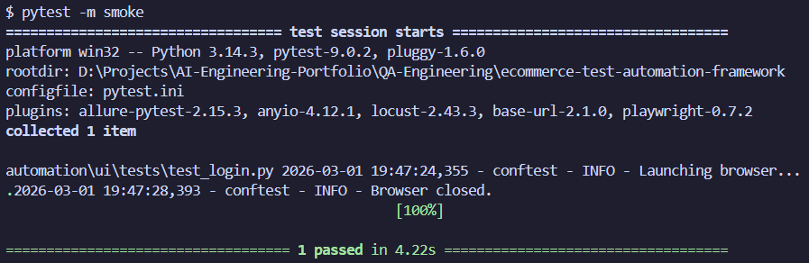

If everything is correct, it should:

* Launch Chromium
* Log in
* Pass test

---

# 🧪 Negative Login Test

Now run:

```bash
pytest -m regression
```

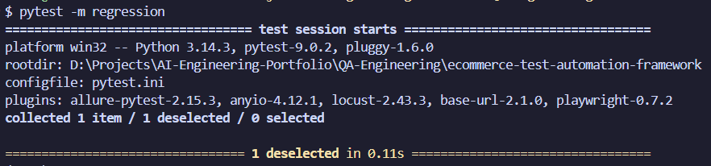

---

# 🛒 Add to Cart Test (Real User Flow)

Simulate actual product action.

Now run:

```bash
pytest -m regression
```

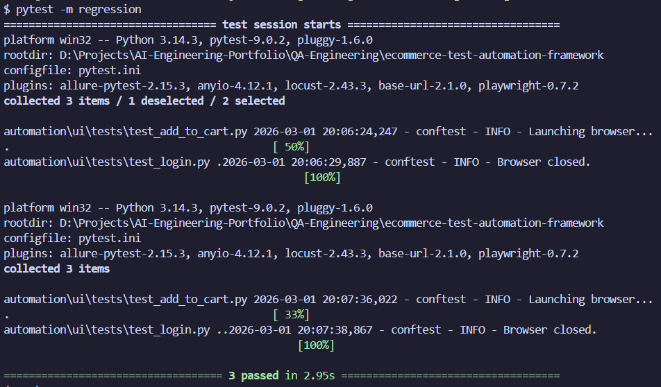

---

# 🚀 API Layer

We will test:

## 🌐 Target API:

### Fake Store API

Base URL:

```
https://fakestoreapi.com
```

This gives you:

* GET /products
* GET /products/{id}
* POST /products
* Users endpoint
* Carts endpoint

---

# 🎯 Build Real API Tests

Run:

```bash
pytest -m api
```

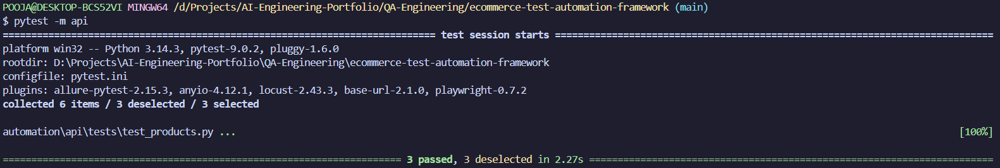

---

# 🚀 JSON Schema Validation

Run:

```bash
pytest -m api
```

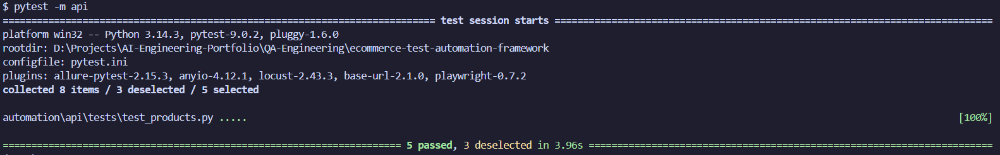

---

# 🚀 Performance Testing with Locust

From root:

```bash
locust -f automation/performance/locustfile.py --host=https://fakestoreapi.com
```

Then open browser:

```
http://localhost:8089
```

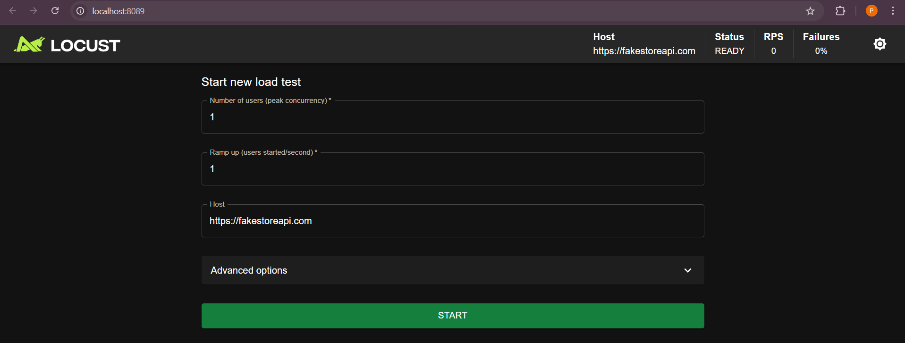

Simulate:

* 50 users
* Spawn rate 5

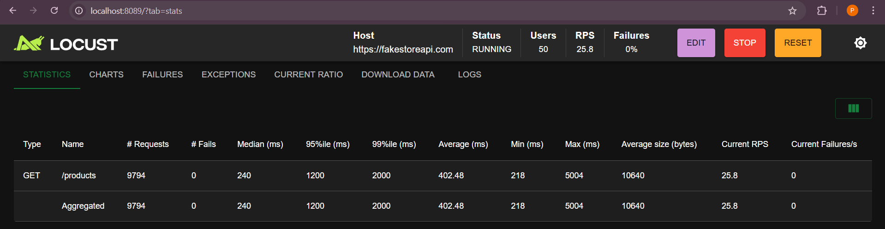

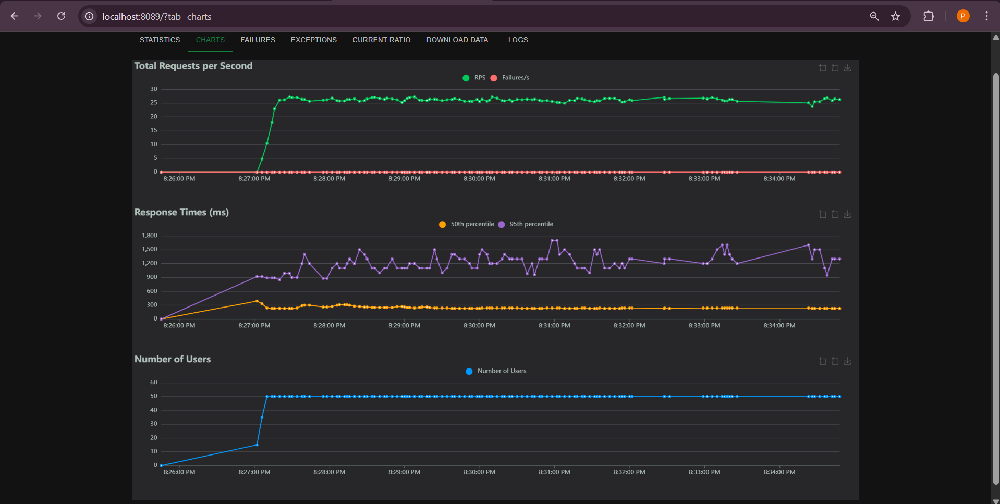

* Users: **50**
* RPS: **25.8**
* Median: **240 ms**
* Avg: **402 ms**
* 95th percentile: **1200 ms**
* 99th percentile: **2000 ms**
* Max spike: **5004 ms**
* Failures: **0%**

---

# 🎯 What This Means

### ✅ System is stable under 50 users

No failures → good stability.

### ⚠️ But latency spikes exist

99th percentile = 2000 ms
Max = 5004 ms

That’s important.

This shows:

> Under load, occasional slow responses occur.

That’s exactly what performance testing should reveal.

---

## 🔥 Performance Test Results (Locust)

Load configuration:

* Users: 50
* Spawn Rate: 5 users/sec
* Endpoint: `/products`

### 📊 Observations:

* Average Response Time: ~402 ms
* 95th Percentile: 1200 ms
* 99th Percentile: 2000 ms
* Max Observed Latency: 5004 ms
* Failure Rate: 0%

### 📌 Conclusion:

System remains stable under moderate concurrent load, but latency spikes occur at higher percentiles indicating potential backend bottlenecks.

---

# 🚀  Add GitHub Actions (Auto Run on Push)

Now go to:

GitHub → Actions tab

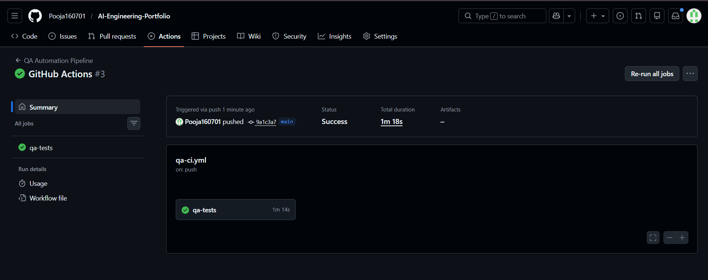

---

# 🐳 Dockerize the Framework

```bash
docker build -t qa-automation-framework .
```

## 🔥 Run Container

```bash
docker run qa-automation-framework
```

---

# 📊 Test Metrics Section

## 📈 Overview

| Category         | Coverage                                |
| ---------------- | --------------------------------------- |
| UI Tests         | Login, Cart, Negative Cases             |
| API Tests        | CRUD, Schema Validation, Negative Cases |
| Smoke Suite      | Critical Flows                          |
| Regression Suite | Full Functional Flow                    |
| Performance      | 50 Concurrent Users Load Tested         |
| Reporting        | Allure HTML Reports                     |
| Failure Handling | Screenshot Capture Enabled              |
| CI Integration   | GitHub Actions                          |
| Containerization | Dockerized Execution                    |

---

## ⚡ Performance Summary

* Users Simulated: 50
* Average Response Time: ~402ms
* 95th Percentile: 1200ms
* Failure Rate: 0%
* Max Latency Spike: 5004ms

---

# 🏆 Upload Test Reports in CI

Now every pipeline run:

✔ Generates report  
✔ Uploads report  

---

# ⚡ Add Parallel Execution

Install:

```bash
pip install pytest-xdist
```

Add to requirements.

Now tests run on multiple CPU cores.

This shows scalability awareness.

---